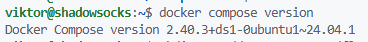
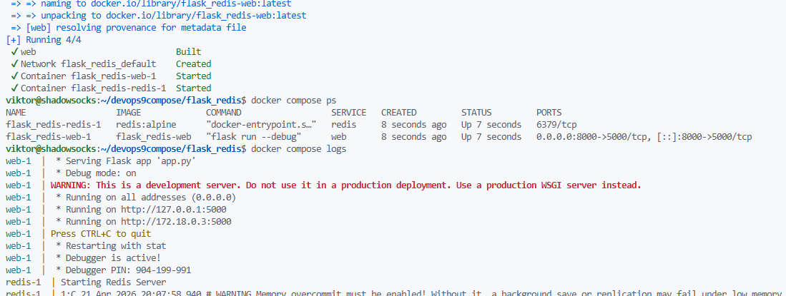
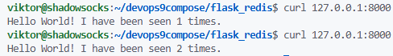
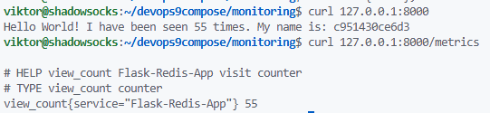
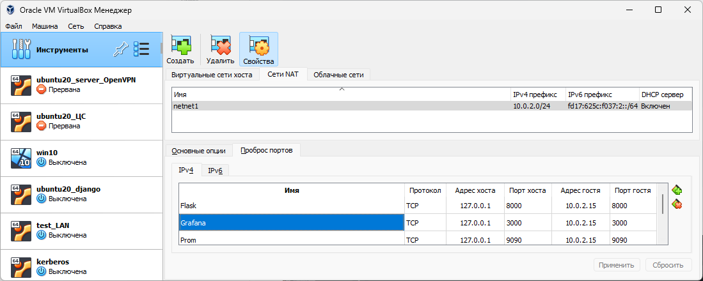
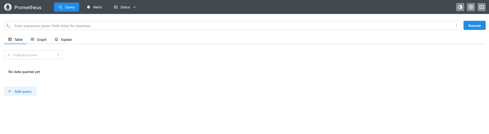
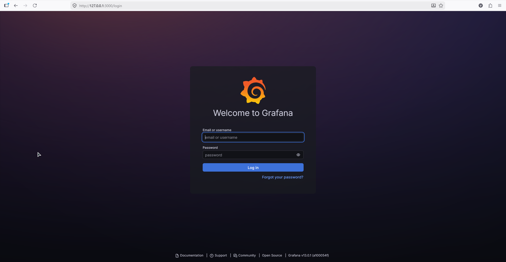
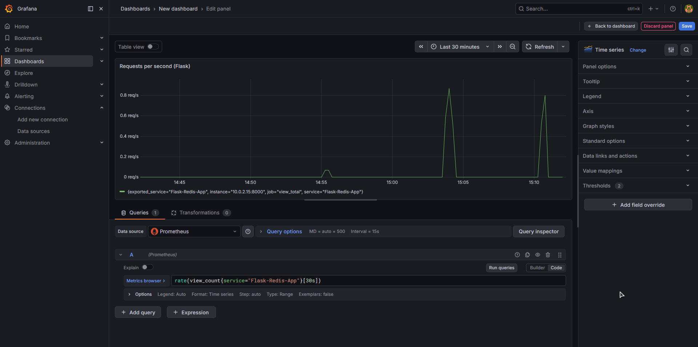

Устанавливаем compose
```
sudo apt update
sudo apt install -y docker-compose-v2
```

Проверяем
```
docker compose version
```


Создаем каталог проекта
```
mkdir -p ~/devops9compose/flask_redis
cd ~/devops9compose/flask_redis
```

Создаем приложение
```
nano app.py
```
Его код
```
import time
import redis
from flask import Flask

app = Flask(__name__)
cache = redis.Redis(host='redis', port=6379)

def get_hit_count():
    return cache.incr('hits')

@app.route('/')
def hello():
    count = get_hit_count()
    return 'Hello World! I have been seen {} times.\n'.format(count)
```

Создаем `requirements.txt`. Зависимости для python
```
flask
redis
```

Создаем `Dockerfile`
```
# syntax=docker/dockerfile:1
FROM python:3.10-alpine
WORKDIR /code
ENV FLASK_APP=app.py
ENV FLASK_RUN_HOST=0.0.0.0
RUN apk add --no-cache gcc musl-dev linux-headers
COPY requirements.txt requirements.txt
RUN pip install -r requirements.txt
EXPOSE 5000
COPY app.py .
CMD ["flask", "run", "--debug"]
```

Создаем `compose.yml`. Используется два сервиса. Web собирается локально, redis берется готовый
```
services:
  web:
    build: .
    ports:
      - "8000:5000"

  redis:
    image: "redis:alpine"
```

Запускаем сервисы по `compose.yml`
```
docker compose up -d
```

Проверяем, что все поднялось. Видим, что оба контейнера запущены
```
docker compose ps
docker compose logs
```


Проверяем приложение
```
curl 127.0.0.1:8000
```


Заменяем содержимое `app.py`
```
import redis
import socket
from flask import Flask, make_response

app = Flask(__name__)
cache = redis.Redis(host='redis', port=6379)

def get_hit_count() -> int:
    return int(cache.get('hits') or 0)

def incr_hit_count() -> int:
    return cache.incr('hits')

@app.route('/metrics')
def metrics():
    metrics_text = f'''
# HELP view_count Flask-Redis-App visit counter
# TYPE view_count counter
view_count{{service="Flask-Redis-App"}} {get_hit_count()}
'''
    response = make_response(metrics_text, 200)
    response.mimetype = "text/plain"
    return response

@app.route('/')
def hello():
    incr_hit_count()
    count = get_hit_count()
    return 'Hello World! I have been seen {} times. My name is: {}\n'.format(
        count,
        socket.gethostname()
    )
```

Пересобираем контейнер
```
docker compose down
```
```
docker compose up -d --build
```

Проверяем приложение 




Создаем папку для мониторинга
```
cd ~/devops9compose
mkdir monitoring
cd monitoring
mkdir prometheus grafana
```

Создаем `compose.yaml`
```
services:
  prometheus:
    image: prom/prometheus
    container_name: prometheus
    command:
      - '--config.file=/etc/prometheus/prometheus.yml'
    ports:
      - 9090:9090
    restart: unless-stopped
    volumes:
      - ./prometheus:/etc/prometheus
      - prom_data:/prometheus

  grafana:
    image: grafana/grafana
    container_name: grafana
    ports:
      - 3000:3000
    restart: unless-stopped
    environment:
      - GF_SECURITY_ADMIN_USER=admin
      - GF_SECURITY_ADMIN_PASSWORD=grafana
    volumes:
      - ./grafana:/etc/grafana/provisioning/datasources
      - grafana_data:/var/lib/grafana

volumes:
  prom_data:
  grafana_data:
```

Создаем конфиг Prometheus `prometheus/prometheus.yml`
```
global:
  scrape_interval: 5s
  scrape_timeout: 3s
  evaluation_interval: 15s

scrape_configs:
  - job_name: prometheus
    metrics_path: /metrics
    static_configs:
      - targets:
          - localhost:9090

  - job_name: view_total
    metrics_path: /metrics
    scrape_interval: 15s
    scrape_timeout: 10s
    static_configs:
      - targets:
          - 10.0.2.15:8000
        labels:
          service: Flask-Redis-App
```

Создаем datasource для Grafana `grafana/datasource.yml`
```
apiVersion: 1

datasources:
  - name: Prometheus
    type: prometheus
    url: http://prometheus:9090
    isDefault: true
    access: proxy
    editable: true
```

Запускаем мониторниг
```
docker compose up -d
docker compose ps
```

Делаем проброс


Открывыем
```
http://127.0.0.1:9090
http://127.0.0.1:3000
```



Авторизация Grafana
```
login: admin
password: grafana
```


Отображение статистики в Grafana
